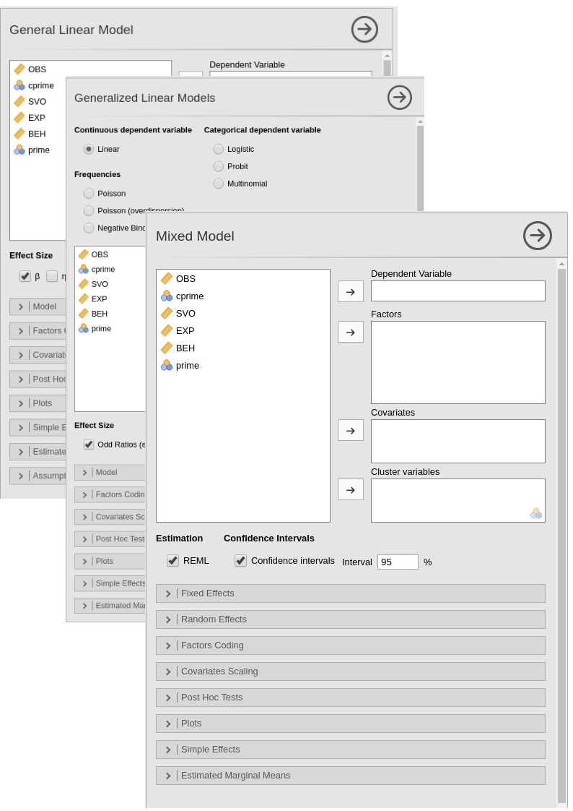

```{r echo=FALSE,results='hide'}
```


GAMLj version 1.0 is out, more powerful than ever but as easy as usual!  Module GAMLj is a suite for jamovi to estimate, manipulate, and visualize linear models, from simple regression/ANOVA models (GLM) to mixed models and generalized models (logistic, multinomial and similar models). Version 1.0 offers many new features for all of those models, such as conditioning continuous moderators at any value you want, clear description of the contrast coding for catagorical variables, and estimation of marginal means at both categorial and continuos variables levels. Specific new features were also added for each model, like significance testing and plotting of random effects in the mixed model, or normality tests for the GLM. There's plenty to explore in GAMLj, and plenty to do.  

Version 1.0 benefits from several months of testing of previous versions, yielding a module based on more solid code and a robust interface. The philosophy behind GAMLj is still the same: Providing the user with a simple interface for all the linear models handled by the module,  allowing the user to interact in the same way with different models, no matter how complex or easy the models are, or what statistical machinery is working behind the scene. But version 1.0 does not only consolidate the past: new features were added, many of them available, in a single module, only in jamovi. Let's see what is confirmed and what is new.




## Common features of GAMLj models

Users of statistical software, expecially at the beginning of their statistical journey, get to know the charateristics of linear models by studying simple regression and ANOVA: in GAMLj, if you know how to run an regression/ANOVA, you can run all the linear models available, flying over the technicalities and getting the job done, correctly. 

In fact, for the GLM, the mixed model and the generalized linear model GAMLj offers plenty of tools to explore and test model results:

* Continuous and categorical independent variables
* F-test and parameter estimates
* Confidence intervals
* Simple slopes analysis
* Simple effects
* post-hocs analysis
* Plots for up to three-way interactions for both categorical and continuous independent variables.
* Automatic selection of best estimation methods and degrees of freedom selection
* Type III estimation

All those operation can be done on a pletora of linear models:

* OLS Regression (GLM)
* OLS ANOVA (GLM)
* OLS ANCOVA (GLM)
* Random coefficients regression (Mixed)
* Random coefficients ANOVA-ANCOVA (Mixed)
* Logistic regression (GZLM)
* Logistic ANOVA-like model (GZLM)
* Probit regression (GZLM)
* Probit ANOVA-like model (GZLM)
* Multinomial regression (GZLM)
* Multinomial ANOVA-like model (GZLM)
* Poisson regression (GZLM)
* Poisson ANOVA-like model (GZLM)
* Overdispersed Poisson regression (GZLM)
* Overdispersed Poisson ANOVA-like model (GZLM)
* Negative binomial regression (GZLM)
* Negative binomail  ANOVA-like model (GZLM)


