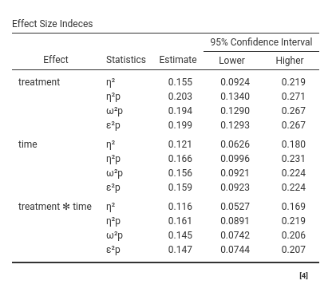

```{r echo=FALSE,results='hide'}
source("../R/functions.R")
```

`r keywords("jamovi, GLM, effect size indices, omega-sqaured, eta-squared, epsilon-squared")`

`r version("2.4.0")` 

  
# Introduction

Standardized Effect size indices produced by GLM module are the following:

  - $\beta$ : standardized regression coefficients
  - $\eta^2$: "semi-partial" eta-squared 
  - $\eta^2$p : partial eta-squared
  - $\omega^2$p : partial omega-squared 
  - $\epsilon^2$p : partial epsilon-squared 

All coefficients but the betas are computed with the approapriate function of the R package [effectsize](https://cran.r-project.org/web/packages/effectsize/index.html)

# $\beta$ : beta

For continuous variables, it simply corresponds to the B coefficient obtained after standardizing all variables in the model. The standardization of the continuous variables is done before any transformation is applied, so if a complex model requires interaction or polynomial terms, the terms are computed after standardization, and the $\beta$ are consistent.

For categorical variables, however, some comments are in order: Categorical variables are not standardized in `r gamlj()`, so the $\beta$ should be interpreted in terms of standardized differences in the dependent variable between the levels contrasted by the corresponding contrast. Consider the following example: Two groups (variable `groups`) of size 20 and 10 respectively, are compared on a variable Y. If one uses `r gamlj()` default contrast coding (`simple`), the B is the difference in groups means. The $\beta$ is the difference between the average z-scores of the dependent variable between the two groups. 
Assume these are the results:

`r pic("details/glm/effectsize_example1_1.png")`

The beta is 0.352, so it means that if we compute the mean difference  between groups in the standardized _y_, we obtain 0.352. In fact. 

`r pic("details/glm/effectsize_example1_2.png")`

However, the $\beta$ you obtain is not the correlation between _zy_ and _groups_. The correlation is 0.169:

`r pic("details/glm/effectsize_example1_3.png")`

Why is there this discrepancy? Because the groups are not balanced, so when the correlation is computed, the variable _groups_ is standardized, so the contrast coding values depend on the relative size of the groups. The actual groups coding values used by the Pearson's correlations are the following:

`r pic("details/glm/effectsize_example1_4.png")`

Thus, the correlation corresponds to running a regression with _zy_ as dependent variables and a continuous variable featuring either -.695 or 1.390 as values. The $\beta$ yielded by `r gamlj()`, instead, is the mean difference between X levels on the standardized Y. Please notice that other software may yield different  $\beta$'s for categorical variables. 

If the groups are balanced and homeschedastic, the $\beta$ associated with a `simple` contrast corresponds to the fully standardized coefficient.


# $\eta^2$: "semi-partial" eta-squared 

This is the proportion of total variance uniquely explained by the associated effect. Being $SS_{eff}$ the sum of squares of the effect and $SS_{res}$ the sum of squares residuals or of error, and $SS_{other}$ the sum of sum of squares associated with any other effect in the model other than $eff$, we have:

$$\eta^2={{SS_{eff} \over {SS_{eff}+SS_{other}+SS_{res}}}}$$

where $SS_{eff}+SS_{other}+SS_{res}=SS_{total}$

# $\eta^2$p : partial eta-squared

This is the proportion of partial variance uniquely explained by the associated effect. That is, the variance uniquely explained by the effect expressed as the proportion of variance not explained by the other effects. Here the variance explained by the other effects in the model is completely partialed out. Its formula is:

$$\eta^2p={{SS_{eff} \over {SS_{eff}+SS_{res}}}}$$

clearly, if there is only one independent variable, $\eta^2=\eta^2p$

# $\omega^2$p : partial omega-squared 

This is the _expected value in the population_ of the proportion of partial variance uniquely explained by the associated effect. In other words,it is the unbiased version of $\eta^2p$. There are different formulas to visualize its computation, here is one. If $df_{res}$ are the degrees of freedon of the residual variance, $df_{eff}$ are the degrees of freedom of the effect, and N is the sample size, we have:

$$\omega^2p={{SS_{eff}-SS_{res} \cdot ({df_{eff}/df_{res}) \cdot }}\over{ SS_{eff}+SS_{res} \cdot [({N-df_{eff})/df_{res}}]
}}$$

It's clear that omega is similat to $\eta^2p$, but applies a correction for the degress of freedom. In fact, as N increases, the two indices converge.

# $\epsilon^2$p : partial epsilon-squared 

Partial Epsilon-squared is also a correction of $\eta^2p$, but the correction involves only the estimation of the sum of squares of the effect, not the partial variance on which the effect is compared

$$\epsilon^2p={{SS_{eff}-SS_{res} \cdot ({df_{eff}/df_{res}) \cdot }}\over{ SS_{eff}+SS_{res}}}$$

# Confidence intervals

In option tab `Options` it is possible to ask additional tables for the effect size indices, containing the effect size indices and their confidence intervals




Details for the confidence intervals computation can be found in [Ben-Shachar, Makowski & Lüdecke (2020). Compute and interpret indices of effect size. CRAN](https://github.com/easystats/effectsize)


`r issues()`