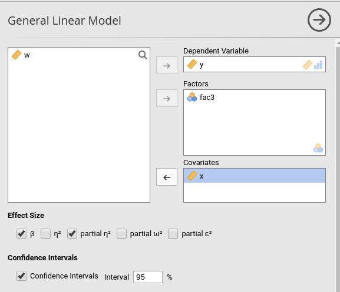
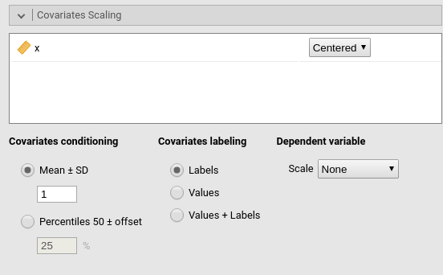
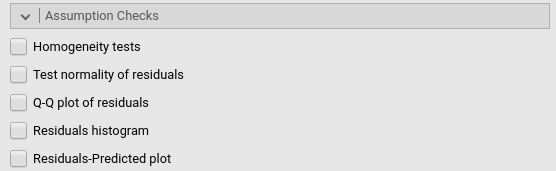
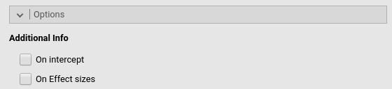

```{r echo=FALSE,results='hide'}
source("../R/functions.R")
```

**General Linear Model** module of the GAMLj suite for jamovi

`r version("2.4.0")` 


The module estimates a general linear model with categorial and/or continuous variables, with options to facilitate estimation ofinteractions, simple slopes, simple effects, etc.

# Module
The module can estimate OLS linear models for any combination of categorical and continuous variables, thus providing an easy way for multiple regression, ANOVA, ANCOVA and moderation analysis. 

# Estimates
The module provides ANOVA tables and parameters estimates for any estimated model. Effect size indices (eta, partial eta, partial omega, partial epsilon, and beta) are optionally computed.

Variables definition follows jamovi standards, with categorical independent variables defined in "factors" and continuous independent variables in "covariates".



Effect size indices are optionally computed by selecting the following options (see  `r link_pages("details_glm_effectsize")`):

  - __beta__ : standardized regression coefficients. Continuous variables are standardized and categorical ones are contrast coded (-1 0 1) before estimating the parameters.
  - $\eta^2$: "semi-partial" eta-squared 
  - $\eta^2$p : partial eta-squared
  - $\omega^2$p : partial omega-squared 
  - $\epsilon^2$p : partial epsilon-squared 

Confidence intervals of the parameters can be also selected.

# Model 

By default, the model terms are filled in automatically for main effects and for interactions with categorical variables. 


Interactions between continuous variables or categorical and continuous variables can be set by clicking the second arrow icon.

```{Call_child, child='commons/nonlinear_chunk.Rmd'}
```


The option `Fixed Intercept` includes an intercept in the model. Unflag it to estimate zero-intercept models (Regression through the origin, but see [here](https://dynamicecology.wordpress.com/2017/04/13/dont-force-your-regression-through-zero-just-because-you-know-the-true-intercept-has-to-be-zero/) before you do it ). 

# Factors coding


```{Call_child, child='commons/factorCoding_chunk.Rmd'}
```

More details and examples `r link_pages("ros_contrasts")`.


# Covariates Scaling


Continuous variables can be centered, standardized (`z-scores`), log-transformed (`Log`) or used as they are (`none`). The default is `centered` because it makes our lives much easier when there are interactions in the model, and do not affect the B coefficients when there are none. Thus, if one is comparing results with other software that does not center the continuous variables, without interactions in the model one would find only a discrepancy in the intercept, because in GAMLj the intercept represents the expected value of the dependent variable for the average value of the independent variable. If one needs to _unscale_ the variable, simply select `none`.


```{Call_child, child='commons/covariateScaling_chunk.Rmd'}
```

The option __Dependent variable__ `score` allows to transform the dependent variable. The dependent variable can be centered, standardized (`z-scores`), log-transformed (`Log`) or used as they are (`none`). The default is `none`, so no transformation is applied.

# Post-hocs


```{Call_child, child='commons/posthoc_chunk.Rmd'}
```


# Plots


```{Call_child, child='commons/plots_chunk.Rmd'}
```


# Estimated marginal means


```{Call_child, child='commons/emm_chunk.Rmd'}
```


# Assumptions checks



* `Homogeneity tests` provides [Levene's test](https://biostats.w.uib.no/test-for-homogeneity-of-variances-levenes-test/){target="_blank"} for equal variances across groups defined by factors  (homoschedasticity).

* `Normality of residuals` provides [Klomogorov-Smirnov](https://en.wikipedia.org/wiki/Kolmogorov%E2%80%93Smirnov_test){target="_blank"} and [Shapiro-Wilk](https://en.wikipedia.org/wiki/Shapiro%E2%80%93Wilk_test#Interpretation){target="_blank"} tests for normality of residuals.

* `Q-Q plot` outputs a Q-Q plot (observed residual quantiles on expected residual quantiles). More general info [here](https://en.wikipedia.org/wiki/Q%E2%80%93Q_plot){target="_blank"}

* `Residuals histogram` outputs the histogram of the distribution of the residuals, with an overlaying ideal normal distribution with mean and variance equal to the residuals distribution parameters.

* `Residuals-Predicted plot` produces a scatterplot with the residuals on the Y-axis and the predicted in the X-axis. It can be usufull to assess heteroschdasticity.

# Options



Additional options that do not fit elsewhere.

* __`Additional Info`__

    * `On intercept`_ provides effect size for the intercept
    * `On Effect sizes`: outputs a new table with all effect sizes available, with confidence intervals 
    * see `r link_pages("details_glm_effectsize")`


# Examples

Some worked out examples of the analyses carried out with jamovi GAMLj are posted here (more to come)

`r include_examples("glm")`

`r issues()`

